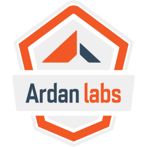

# RustConf 2024 Workshop

To view the manual/slides locally:

1. Install `mdbook` with `cargo install mdbook`.
2. Navigate to the `manual` directory - `cd manual`.
3. Run `mdbook serve` and connect to [http://localhost:3000/](http://localhost:3000)

The examples all assume that you generate data with the `data_builder`
task. You can tweak it to generate 1 million or 1 billion rows; the
1 million is a great starting point, as the earlier examples take
*a while* with a billion rows!

Thank  you to everyone for attending. I hope to see you at [Ardan Labs](https://ardanlabs.com/)

