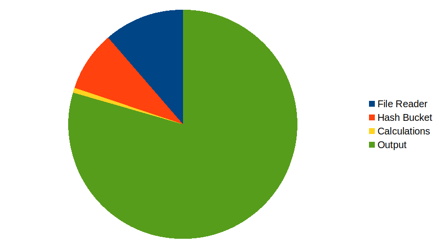

# Results

> If anyone decided to run this on a billion rows, I apologize for not warning you. I hope it's either finished,
> or you've finished rebooting.

## One Million Rows

The one million row output is pretty good. The timings aren't bad either. On my 20-core Intel workstation
at the office:

```
-----------------------------------------
File reader time: 0.098s
Hash time:        0.074s
Calculate time:   0.006s
Print time:       0.690s
TOTAL:            0.867s
```

## One Billion Rows

The one billion row output is not so great. After a few minutes, the Linux Out-of-Memory killer took down the
process as it approached 10 Gb of memory usage (I had other stuff running, too).

So what happened? Our file reader is allocating a structure including a string for every single row. That's 1,000,000,000
strings. We're completely filling our computer with the input data!

## Lessons Learned

Despite this, it's not a complete wash. We've got a good idea of relative execution costs of parts of our program:



So the overall time is *dominated* by the output. Next worse is the file reader, then the hash, and the
calculation is extremely fast.

## Next Steps

It would be nice to not crash on a large dataset. Let's fix that!