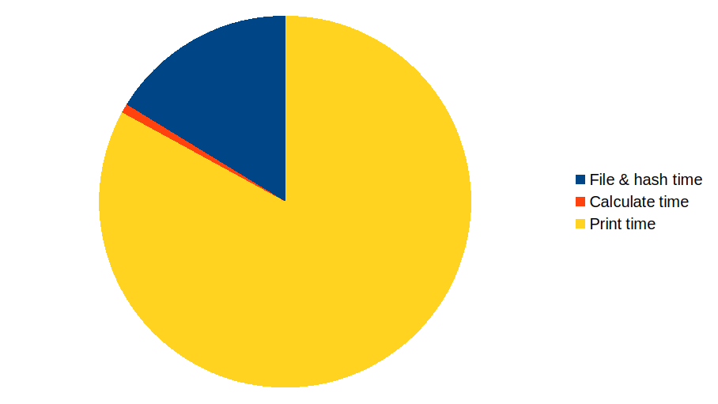
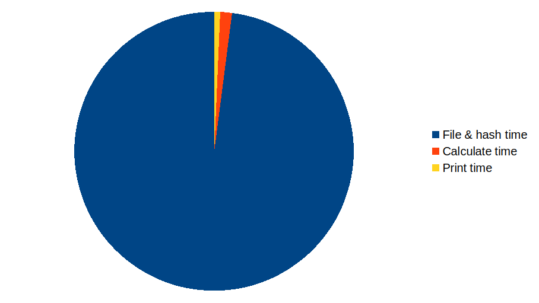

# Why Microbencharks Can Suck

Let's look at a plot of each of those results:

|One Million Rows|One Billion Rows|
|---|---|
|||

There's a lesson here: micro-benchmarks can be really useful, looking at a sample of your data
rather than the big picture. But when the sample is small enough, you can get a very misleading
picture!

With a million rows, it looks like we really need to optimize `println!` (we do, but that's in
the unreasonable section!). With a billion rows, it's clear that reading the file and hashing
everything is the real bottleneck.

So, when you're optimizing, make sure you're looking at the big picture!

> If you read `r/rust` or similar, you'll be used to people saying `HashMap` is really slow.
> Even the Rust compiler uses `FxHashMap` instead of `HashMap` in some places. So let's
> go out and prove Reddit right!