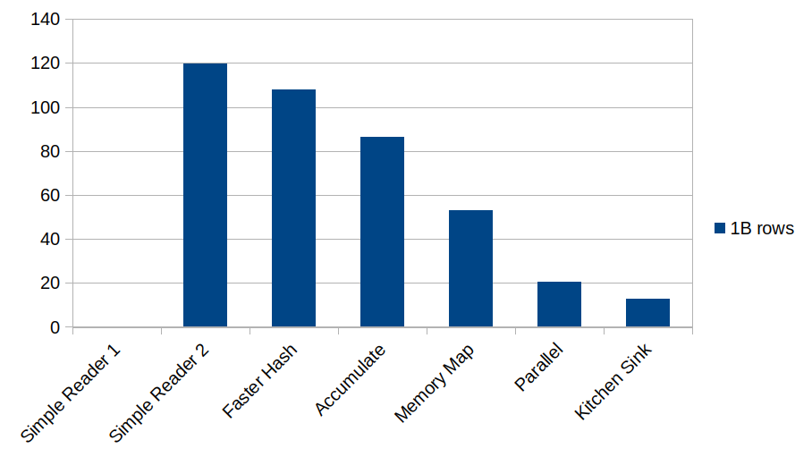

# Final Timings

There's something very important to notice here:

We didn't get a *massive* speedup using the truly heroic measures. We're starting to hit diminishing returns
for this approach. We're doing really, really well - but each successive optimization from now on is clawing
a little more performance out of the system.

It's important for you to think about where the line is drawn for your project.