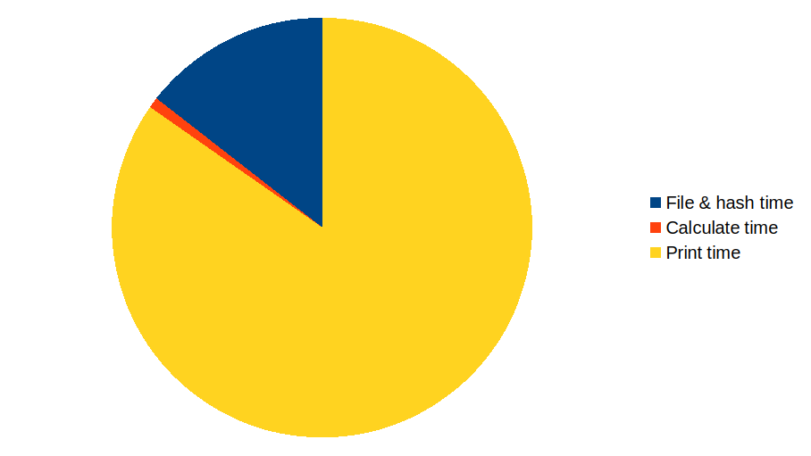
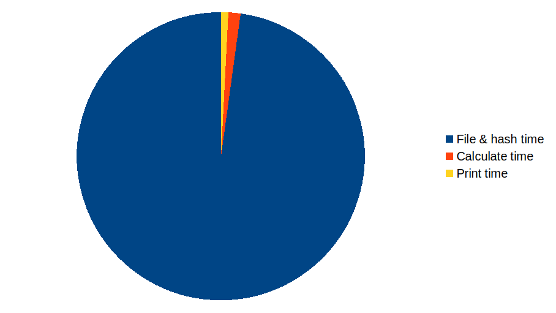

# Results

So how does it do? We've tackled Reddit's favourite optimization, beyond "did you remember to use `--release`?"!

> If you have forgotten to use `--release`, it happens to all of us.

With 1 million rows:

```
File & hash time: 0.120s
Calculate time:   0.007s
Print time:       0.703s
TOTAL:            0.830s
```

And with 1 billion rows:

```
File & hash time: 107.246s
Calculate time:   1.516s
Print time:       0.905s
TOTAL:            109.667s
```

Oof, 109 seconds still isn't going to win any prizes --- but we're faster than the 118 seconds we had before.

| 1 million rows | 1 billion rows |
|----------------|----------------|
 | 

> So, in conclusion---the `FxHashMap` *is* faster, but it isn't the answer to all of our problems!
